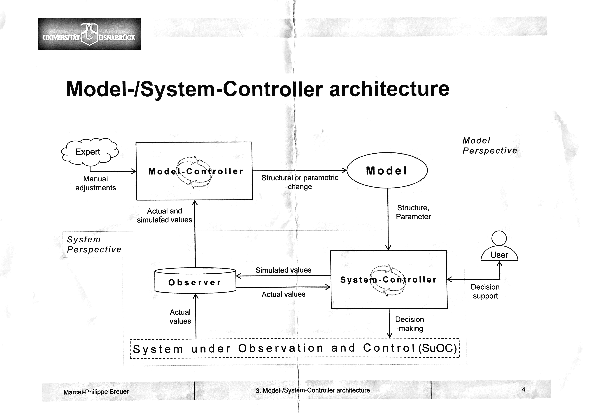

.. Mosyco documentation master file, created by
   sphinx-quickstart on Mon Oct 23 17:24:48 2017.
   You can adapt this file completely to your liking, but it should at least
   contain the root `toctree` directive.

.. _documentation:

********************
Mosyco Documentation
********************

Welcome to Mosyco's Documentation!
----------------------------------

The following pages outline the first prototype of a Model-/System-Controller architecture as conceived by Breuer [1]_. It is an academic project in the domain of Information Systems, exploring how *self-correcting* models might change model-based business planning.

.. toctree::
   :maxdepth: 2
   :caption: Contents:

   prototype
   readme
   Data Preparation <https://vab9.github.io/observer/data-prep.html>

The Problem
-----------

Model-based business planning requires domain knowledge. This knowledge often comes from domain experts and will always reflect the currently available information about the system at the time it is devised.

Most real-life business systems are dynamic in nature. Without constant readjustments to the corresponding model, it may lose its predictive quality over time. The domain experts must therefore regularly adjust the model to fit the changing environment. [2]_

As business modelling can be difficult and expensive, the cost of maintaining accurate models for dynamic systems can grow rapidly. The proposed Model-/System-Controller architecture seeks to mitigate this issue by integrating a self-correction mechanism (or self-adaptive property) [1]_ into the model.

The Model-/System-Controller Architecture
-----------------------------------------

    Model-/System-Controller Architecture. Source: Breuer, 2016 [1]_

The architecture introduces several interconnected components. The components that are important to be aware of for this project are:
- The *system under observation* provides a stream of actual system data to the observer.
- The *observer* monitors the running system for deviations from the model and alerts the Model-Controller if such deviations exceed some (possibly dynamic) threshold.
- The *model-controller* makes structural or parametric changes to the model in order to reflect changes in the running systems environment.
- The *model* allows planning for some business purpose. It is based on expert- and/or domain-knowledge.

Detailed Information about the prototype can be found here: :ref:`prototype`. Information on how to install and test the prototype can be found here in its Readme: :ref:`readme`. For an in-depth description of the prototype's components and how they work together, see the accompanying paper.

Indices and tables
------------------

* :ref:`genindex`
* :ref:`modindex`
* :ref:`search`

Academic Sources
----------------

For a detailed list of academic sources that this project references in the footnotes, please consult the accompanying paper's bibliography:

    `"Real-Time Gap Analysis - Konzeption und prototypische Implementierung einer automatisierten Abweichungsanalyse zur betriebswirtschaftlichen Planung" <http://127.0.0.1>`_

.. [1] Breuer, 2016
.. [2] Sauter, 2011
