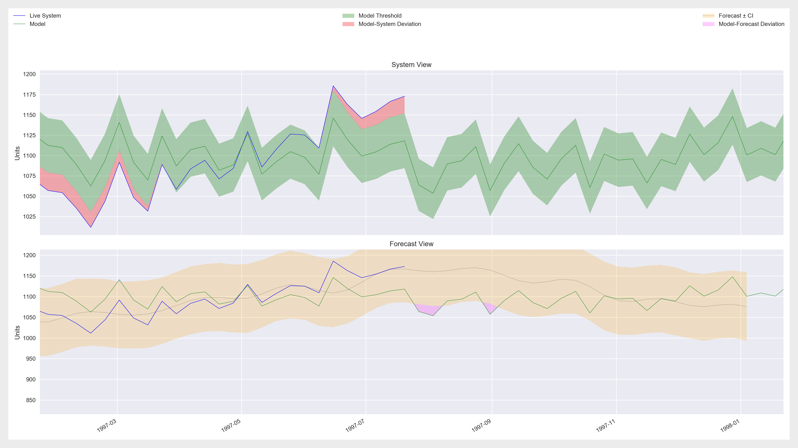

.. _prototype:

The Mosyco Prototype
====================

Overview
--------

The mosyco prototype implements the observing part of the Model-/System-Controller architecture. It monitors the running system and evaluates the model performance in real-time. It outputs deviation logs and offers an optional dashboard view of live model performance.

Mosyco is capable of processing multiple live systems against multiple models. In GUI-Mode, however, the program is restricted to one single model and one single live system for performance reasons. If both GUI-Mode and multiple system/model columns are supplied as command line options, the GUI-option takes precedence and the program will only use the first model and the first system for that invocation.

Components
----------

The core functionality of the program is controlled by the following modules:

Reader
    At startup the reader reads the sample data into a DataFrame. Then pushes to entire model data set to the Inspector. Finally, it enters a loop to push actual system data rows to the inspector one-by-one.

Inspector
    The Inspector does all of the analytical work. When it is started, it enters an infinite loop in which it continuously pulls system data from the reader, saves this data to its own DataFrame, and evaluates that data. Specifically, it looks for system-model deviations above a certain threshold, and outputs a log message detailing each deviation. In addition to this, at the end of each period (in this case every year) the Inspector generates a forecast for the following year based on all the previously amassed data for each system. This forecast is then used as an additional benchmark against which to evaluate the model. Deviations between the forecast and the model are also emitted as log messages.

Plotter
    The Plotter is only activated in GUI-Mode. It receives the necessary data from the Inspector and plots it as soon as it is available. It uses PyQt5 and matplotlib in order to produce a visualization of the Mosyco prototype. The plotter resamples the data before plotting to generate a smoother and more readable plot.

    Mosyco in GUI-Mode, showing System and Forecast Views

Summary
-------

When the program is started, it immediately loads the model data into memory. The names of the columns containing the model data can be specified as command line options. The reader then begins pushing system data to inspector, which stores and analyses it. Deviations between model and system or model and forecasts are logged either directly to console or to a logfile, depending on the configuration. If GUI-Mode is enabled, a live plot visualizes the progress of the inspector. Once the reader has run out of data to push to the inspector, the program terminates.
